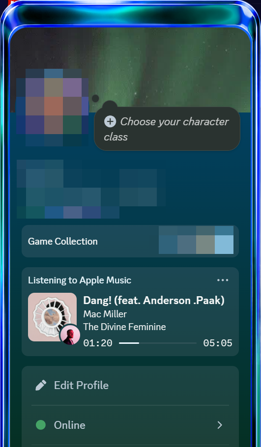
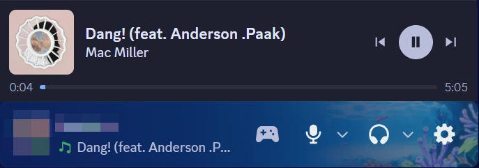
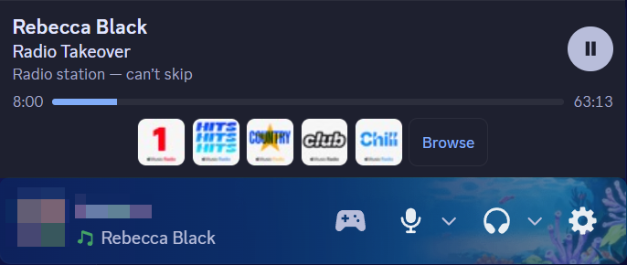

# Apple Music Rich Presence for Vencord (Windows)

A Vencord **userplugin** that brings Apple Music rich presence to Windows.

Vencord's official [`appleMusic.desktop`](https://github.com/Vendicated/Vencord/tree/main/src/plugins/appleMusic.desktop)
plugin talks to the macOS Music app over AppleScript, so it only runs on a Mac. This one reads the
**Windows System Media Transport Controls** (SMTC) instead — the same thing that fills in the media
popup on the volume flyout — so it works with the Apple Music app from the Microsoft Store and with
iTunes for Windows.

See [`appleMusicWindows.desktop/README.md`](appleMusicWindows.desktop/README.md) for what it shows,
how it works, and the Apple-Music-specific quirks it works around.

## What it looks like

The activity is a **Listening** activity, so Discord renders it with the music note and a real
seek bar, with album artwork and the artist's photo as the small icon:



A player sits above the account panel with artwork, track, artist and working transport controls:



On an **Apple Music radio station** skipping is impossible - Apple's licensing forbids it, and the
media session says so. Rather than leaving two dead buttons, the player explains why and offers
station artwork tiles that switch station, plus a link into the Radio tab:



Station logos are fetched from each station's page at runtime rather than hardcoded, so they keep
working when Apple changes artwork.

### Compared with the official macOS plugin

| | `appleMusic.desktop` | this plugin |
| --- | --- | --- |
| Windows | no — AppleScript and `osascript` | **yes** — Windows media session |
| Player controls | none | **play / pause / skip** |
| Radio stations | shows a reduced activity | **explains it, offers station switching** |
| Activity type | Playing (game controller) by default | **Listening (music note) by default** |
| Artwork / link lookup | first track of the matching album | **scored on track name, then album, then artist** |
| Seeking | n/a | not possible — Apple Music ignores it, see the plugin README |

That last row is a real bug in the macOS plugin, not just a difference: matching on the album alone
returns an arbitrary track from the right album, so *Stay* resolves to *Butterflies*' artwork and
links. Reported upstream as [Vencord#4593](https://github.com/Vendicated/Vencord/issues/4593);
`dev/test-upstream-bug.mjs` reproduces it against the live API.

## Layout

```
appleMusicWindows.desktop/   <- copy this whole folder into Vencord's src/userplugins/
  index.tsx                  Discord-side plugin: settings, activity, panel patch
  native.ts                  Node-side: PowerShell helper + iTunes lookup
  PlayerComponent.tsx        The play/pause + skip player above the account panel
  store.ts                   Shares the polled track data with the player
  stations.ts                Default radio stations + link parsing
  styles.css                 Player styling
  hoverOnly.css              Toggled on by the "hover controls" setting
  smtcScript.ts              GENERATED from dev/smtc.ps1
  README.md
dev/                         Not shipped - source of truth + test harnesses
  smtc.ps1                   The PowerShell media-session helper
  gen-script.mjs             Embeds smtc.ps1 into smtcScript.ts
  harness.mjs                Drive the helper outside Discord
  test-protocol.mjs          get / sources / cmd, plus malformed input
  test-native.mjs            The real native.ts, end to end, with assertions
  test-embed.mjs             Verify the embedded copy matches and runs
  test-bundle.mjs            Pull the script out of Vencord's build and run it
  test-match.mjs             Verify iTunes track matching
  test-itunes.mjs            Raw iTunes API responses
  test-patch.mjs             Account-panel patch, with and without SpotifyControls
  test-stations.mjs          Resolve artwork for every default station (rot check)
  test-derivation.mjs        How much code is still shared with the macOS plugin
  test-upstream-bug.mjs      Reproduce the upstream track-matching bug
  itunes-results.mjs         Print iTunes results in API order
  sources.mjs                What media sources does Windows see right now?
  probe-controls.ps1         Read-only: what controls does the session advertise?
assets/                      Screenshots used by this README
```

## Requirements

- Windows 10 1809 or newer (SMTC), which the Apple Music app already requires
- Windows PowerShell 5.1 — ships with Windows; **not** PowerShell 7
- A **source install** of Vencord (the official installer's build cannot load userplugins)
- Node.js 18+ and pnpm

## Installing

> [!IMPORTANT]
> Userplugins require building Vencord from source. Running `pnpm inject` **replaces** the build that
> the official Vencord installer put in place. To go back, run `pnpm uninject` in the source folder and
> re-run the official installer.

### 1. Get a Vencord source install

Follow the [official guide](https://docs.vencord.dev/installing/), or:

```powershell
git clone https://github.com/Vendicated/Vencord
cd Vencord
pnpm install --frozen-lockfile
```

### 2. Add the plugin

```powershell
mkdir src\userplugins
```

Copy the `appleMusicWindows.desktop` folder into `src\userplugins\`, so you end up with
`src\userplugins\appleMusicWindows.desktop\index.tsx`.

Or link it, so edits here show up without copying again:

```powershell
# from the Vencord folder, in an elevated terminal
New-Item -ItemType Junction -Path src\userplugins\appleMusicWindows.desktop `
         -Target C:\Users\bsims\vencord-plugins\apple-music\appleMusicWindows.desktop
```

### 3. Build and inject

```powershell
pnpm build
pnpm inject
```

Restart Discord, open **Settings → Vencord → Plugins**, and enable
**AppleMusicWindowsRichPresence**.

## Developing

`dev/smtc.ps1` is the source of truth for the PowerShell helper. After editing it, re-embed it:

```powershell
node dev/gen-script.mjs
```

Then check everything still holds. These all run against whatever is actually playing, so start
Apple Music first:

```powershell
node dev/test-native.mjs     # the real native.ts, end to end, with assertions
node dev/test-protocol.mjs   # get/sources/cmd, bad regex, bad JSON, clean exit
node dev/test-embed.mjs      # embedded copy is byte-identical to smtc.ps1, and runs
node dev/test-match.mjs      # iTunes lookup picks the right song
node dev/test-bundle.mjs     # pull the script back out of Vencord's built bundle and run it
node dev/test-patch.mjs      # panel patch nests correctly with SpotifyControls
node dev/test-stations.mjs   # every default station's artwork still resolves
node dev/harness.mjs 5 2000  # poll the live session 5 times, 2s apart
node dev/sources.mjs         # what media sources does Windows see right now?
node dev/gen-script.mjs --check   # smtcScript.ts is in sync with smtc.ps1
```

`test-protocol.mjs` briefly toggles playback to prove commands are honoured, then restores the
state it found.

`dev/test-native.mjs` is the important one — it bundles the real `native.ts` (stubbing only the two
Vencord/Electron imports) and asserts on the `TrackData` it produces. `dev/harness.mjs` is the
quickest way to just *see* what Windows reports for the current track, without rebuilding Discord.

Both `test-native.mjs` and `test-bundle.mjs` take an optional path to your Vencord folder; they
default to `../Vencord`.

## Troubleshooting

**Nothing shows up.** Open the plugin's settings and press **Show detected media sources**. If Apple
Music isn't listed, Windows itself isn't seeing it — check that its controls appear in the volume
flyout. If it *is* listed but presence is empty, check Discord's console (`Ctrl+Shift+I`) for
`[AppleMusicWindowsRichPresence]`.

**Wrong artwork or wrong song.** Artwork comes from an iTunes Search API lookup by name, so an obscure
or regionally-unavailable track can miss. A continuously streaming station reports no duration, so it
gets no seek bar; a scheduled show usually does report one and keeps the bar.

**Presence lingers after pausing.** That's the default — pausing clears the activity. Turn on
*Keep showing the activity while playback is paused* if you'd rather it stay.

## Credits

The activity-building code and settings are adapted from Vencord's macOS
`AppleMusicRichPresence` by [RyanCaoDev](https://github.com/ryancaodev), GPL-3.0-or-later.
